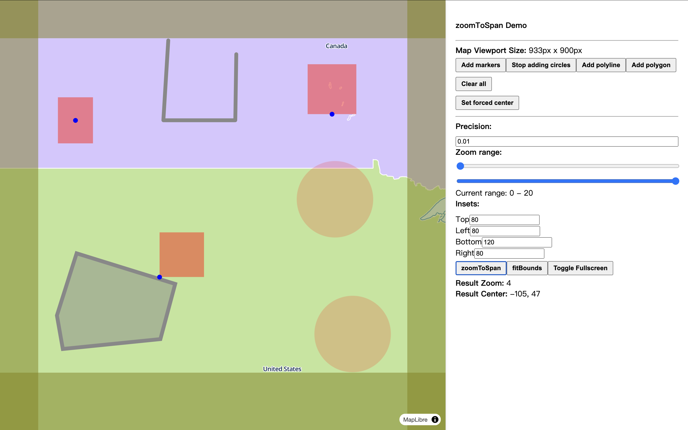
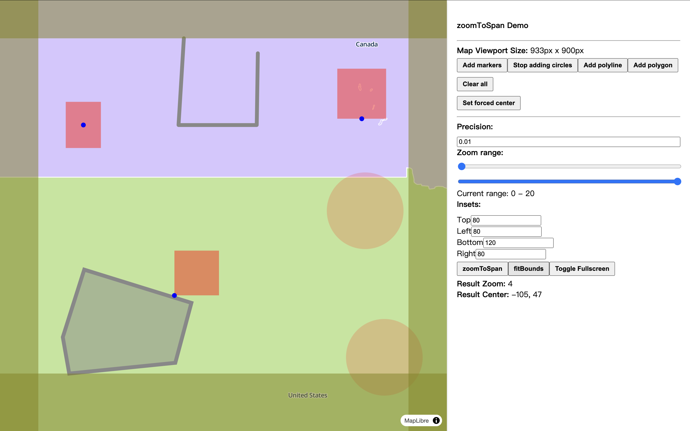

# map-zoomtospan

A cross-platform utility designed to calculate the optimal map zoom level and/or center point for a given map viewport, ensuring a balanced view of map features.

## Installation

```bash
npm install map-zoomtospan
```

## What is "Best View"?

map-zoomtospan is a general-purpose "best view" calculation tool, independent of any specific mapping library. While we currently provide a [MapLibre demo](./demo/MapLibrePage.tsx) to demonstrate its functionality, more demos for additional mapping libraries are coming soon. Adapters for various mapping libraries will also be available in the near future.

A "best view" refers to the zoom level that allows the majority of features/layers to fit within the viewport, with the map centered on these features. For a clearer understanding, see the example below:



Many mapping libraries, like MapLibre, offer `fitBounds/setFitView` methods for similar purposes. However, these methods focus only on the spatial bounds of features and ignore the size of markers, or the width of polylines and polygons—leading to imperfect results. Here’s an example of this limitation:



While adjusting the padding of the `fitBounds` method can somewhat improve the fit, it often requires case-by-case tweaking rather than offering a consistent solution.

Our approach solves this problem by providing a general "best view" calculation that accommodates not only markers, polylines, and polygons, but also custom overlays. The key requirement for custom overlays is that their size remains consistent, regardless of zoom level.

## How to Calculate the Best View

```typescript
import { mapZoomToSpan } from "map-zoomtospan";

const mapResult = mapZoomToSpan({
  viewport: {
    width: 800, // width of the map element
    height: 600, // height of the map element
    inset: { top: 10, right: 40, bottom: 60, left: 10 }, // padding around the map element
  },
  overlays: [
    { // a marker
      position: { lat: 10, lng: 10 },
      boundingRect: { width: 10, height: 10 },
      anchor: { x: 0.5, y: 0.5 },
    },
    { // a polyline
      points: [
        { lat: 10, lng: 10 },
        { lat: 20, lng: 20 },
        { lat: 20, lng: 10 },
      ],
      width: 5, // line width
    },
    { // a polygon
      points: [
        { lat: 10, lng: 10 },
        { lat: 20, lng: 20 },
        { lat: 20, lng: 10 },
        { lat: 10, lng: 10 }
      ],
      width: 8, // line width
    },
    { // a circle
      center: { lat: 10, lng: 10 },
      radius: 5,
    }
  ],
  zoomRange: [4, 18], // zoom level range
  worldSize: 256, // size of the world map
  precision: 0.001, // zoom level precision
});

if (mapResult.ok) {
    mapSetCenterAndZoom(mapResult.result.center, mapResult.result.zoom);
} else {
  console.error(mapResult.error);
}
```

## Key Concepts

### Map Viewport

The map viewport represents the pixel dimensions (width and height) of the map element. The viewport inset refers to the padding (top, right, bottom, left) where other UI components or controls may cover part of the map.

### Overlays

Overlays represent the features or layers you want to display on the map, such as markers, polylines, polygons, or even custom elements.

We define overlays using the `IStandardOverlay` structure, which includes the position, bounding rectangle, and anchor of the overlay.

- The position is an `ILatLng` coordinate on the map.
- The anchor (represented as percentage values) determines how the bounding rectangle is attached to the position.

This structure works well for markers but can be adapted to describe most types of overlays. Below, we show how to calculate an `IStandardOverlay` from various overlay types. Additionally, we support simplified structures for common overlays.

Example: A marker with a size of `10px * 20px` attached to the position `(10, 80)` is described as:
```typescript
{
  position: {
    lat: 10,
    lng: 80,
  },
  anchor: {
    x: 0.5,
    y: 1,
  },
  boundingRect: {
    width: 10,
    height: 20,
  },
}
```

Example: A polyline with a width of `10px`, and bounds defined by four points `(10, 10), (10, 20), (20, 10), (20, 20)`, can be described in two ways:
1. Using two `IStandardOverlay` objects based on its bounds:
```typescript
[{
  position: {
    lat: 10,
    lng: 10,
  },
  anchor: {
    x: 0.5,
    y: 0.5,
  },
  boundingRect: {
    width: 10,
    height: 10,
  },
}, {
  position: {
    lat: 20,
    lng: 20,
  },
  anchor: {
    x: 0.5,
    y: 0.5,
  },
  boundingRect: {
    width: 10,
    height: 10,
  },
}]
```

2. Using a `IPolylineOverlay`:
```typescript
{
    polyline: {
        points: [
            { lat: 10, lng: 10 },
            { lat: 10, lng: 20 },
            { lat: 20, lng: 10 },
            { lat: 20, lng: 20 },
        ],
        width: 10,
    }
}
```

Polygons follow a similar structure to polylines.

Example: A circle’s bounds form a rectangle, allowing it to be described either as an `ICircleOverlay` or `IStandardOverlay`:
```typescript
{
    circle: {
        center: { lat: 10, lng: 10 },
        radius: 10,
    }
}
```
or
```typescript
{
    position: { lat: 10, lng: 10 },
    anchor: { x: 0.5, y: 0.5 },
    boundingRect: { width: 20, height: 20 },
}
```

For custom overlays, determine the `position`, `anchor`, and `boundingRect` based on the specific requirements.

### Projection and World Size

Since the Earth is spherical and maps are flat, projections are needed. Web maps commonly use the WebMercator projection, which is built into `map-zoomtospan` with a default `worldSize` of `512`.

The WebMercator projection maps the globe to a `0-1` square. The `worldSize` determines the pixel size of this world at zoom level `0`. Each zoom level doubles the required pixel size to display the world. For instance, Leaflet’s default `worldSize` is `256`.

If you are using a custom projection or world size, you can adjust the `worldSize` or implement your own `IProjection`.

### Precision

Some map libraries support fractional zoom levels. If you want more precise zoom calculations, set `precision` to a decimal value for better accuracy.

**However, if your map library doesn't support fractional zoom levels, it's important to set `precision` to `1` to ensure correct behavior.**

### Zoom Range

To limit the zoom level, use the `zoomRange` parameter to specify a minimum and maximum zoom.

### Fixed Map Center

If you need to keep the map center fixed, set the `center` to a specific `ILatLng` point.

## License

This project is licensed under the MIT License. See the [LICENSE](./LICENSE) file for more details.
